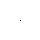

# About
I discovered the idea of growing neural cellular automata
here : https://distill.pub/2020/growing-ca/

Cellular automata theory is a rich field which has been around for some 
time.  The basic idea is that given cells with some initial state and a 
simple update rule can yield interesting and complex behavior.

Neural cellular automata (abbreviated NCA) extends this by having a neural network
function as the update rule, and creating a differentiable environment such that
the NCA is able to learn an update rule that can achieve a desired result.


# Code

# Usage
To train an new NCA model, run the following command:
```
python main.py -t --img path-to-img --model path-to-model
```

To run a trained model:
```
python main.py -e --model path-to-model
```
Run the trained model provided:
```
python main.py -e --model saved_models/lizard_best_model.pt --img images/lizard-emoji_40.png
```